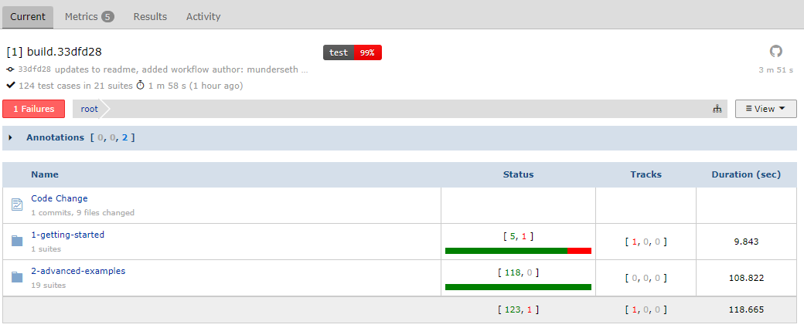
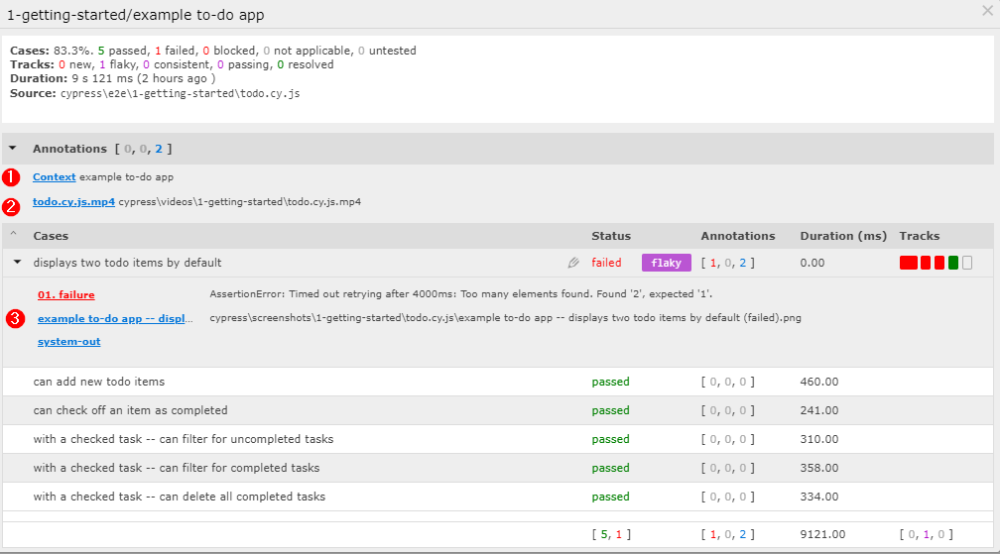
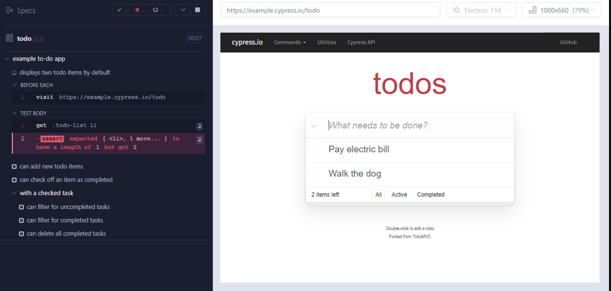

# Example Cypress XML Reporter
Example repo showing how the **Cypress Test Runner**, the [Cypress XML Reporter](https://github.com/testspace-com/cypress-xml-reporter), and [Testspace](https://testspace.com) can work together. The repo demonstrates how `screenshots`, `videos`, and `logs` of failing tests are attached to `suites` and managed in Testspace.



In this example, there are three use cases supported by Testspace that are being demonstrated:
1. The `logs` generated by the *cypress terminal report*
2. The `video` capturing the execution of the *tody.cy.js* file
3. The `screenshot` of the case that failed (see below)

The following suite can be viewed [HERE](https://testspace-com.testspace.com/projects/testspace-com:example-cypress.xml.reporter/spaces/main/current/1-getting-started):



The `cypress/e2e/1-getting-started/tody.cy.js` test file is being used as an example.

The following screenshot can be viewed by clicking on `#3`:

<br>




## Usage
To play around with this example:
- fork the repo
- Enable workflows (required when forking a repo)
- Install the Testspace app - https://github.com/marketplace/testspace-com
- Create a Testspace project based on your repo

> **Note**. You can run the tests using GitHub Actions, with a `push` or  `workflow dispatch` event.

Refer to the [Help Tutorial](https://help.testspace.com/tutorial/setup) for instructions for setting up a Testspace project.


## Repo Setup
The following steps are required to setup from scratch.

`.gitignore`
```
node_modules
cypress/screenshots
cypress/videos
cypress/logs
results
```
### Packages

Create initial `package.json` file.
```
npm init -y
```

```
npm install --save-dev cypress
npm install --save-dev cypress-terminal-report
npm install --save-dev cypress-xml-reporter
```

### Example Code

To run this example:

Using the Cypress [Launchpad](https://docs.cypress.io/guides/getting-started/opening-the-app#The-Launchpad):
```
npx cypress open
```

Using the **Scaffold example specs** provided by the Cypress Launchpad. Note that the `cypress/e2e/1-getting-started/tody.cy.js` test file has an intentional test failure.

### Configuration

For `cypress.config.js`
```
const { defineConfig } = require("cypress");
module.exports = defineConfig({
  video: true,
  reporter: 'cypress-xml-reporter',
  reporterOptions: {
    resultsFolder: './results'
  },
  e2e: {
    setupNodeEvents(on, config) {
      const logsOptions = {
        printLogsToFile: "always",    // "onFail" (default), "always", or "never"
        outputRoot: config.projectRoot + '/cypress/',
        outputTarget: {
          'logs|txt': 'txt',
        }
      };
      require('cypress-terminal-report/src/installLogsPrinter')(on, logsOptions);
      require('cypress-xml-reporter/src/plugin') (on, logsOptions);
    },
  },
});
```

To enable logging `cypress/support/e2e.js`:
```
// Import commands.js using ES2015 syntax:
import './commands'

// Alternatively you can use CommonJS syntax:
// require('./commands')
require('cypress-terminal-report/src/installLogsCollector')();
```
