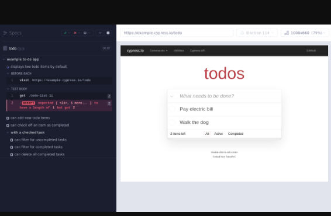

# Example Cypress XML Reporter
Example repo showing how the **Cypress Test Runner**, the [Cypress XML Reporter](https://github.com/testspace-com/cypress-xml-reporter), and [Testspace](https://testspace.com) can work together. The repo demonstrates how `screenshots`, `videos`, and `logs` of failing tests are attached to `suites` and managed in Testspace.

In this example, there are three use cases supported by Testspace that are being demonstrated:
1. The `logs` generated by the *cypress terminal report*
2. The `video` capturing the execution of the *tody.cy.js* file
3. The `screenshot` of the test case - **displays two todo items by default** - that failed (see below)

The following test suite can be viewed [HERE](https://testspace-com.testspace.com/projects/testspace-com:example-cypress.xml.reporter/spaces/main/current/1-getting-started):

The `cypress/e2e/1-getting-started/tody.cy.js` test file is being used as an example.

The following screenshot of the failing test case -- `displays two todo items by default` - can be viewed [HERE](https://testspace-com.testspace.com/projects/testspace-com:example-cypress.xml.reporter/spaces/main/current/1-getting-started) by expanding the arrow (**>**) and clicking on `#3` as displayed above:

 

## Usage
To play around with this example:
- fork the repo
- Enable workflows (required when forking a repo)
- Install the Testspace app - https://github.com/marketplace/testspace-com
- Create a Testspace project based on your repo

> **Note**. You can run the tests using GitHub Actions, with a `push` or  `workflow dispatch` event.

Refer to the [Help Tutorial](https://help.testspace.com/tutorial/setup) for instructions for setting up a Testspace project.

